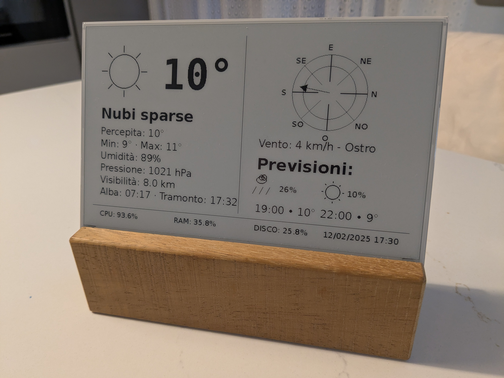

# Bea-ink

A sophisticated weather station display for E-Paper displays, designed specifically for Venice, Italy. This project combines real-time weather data from OpenWeatherMap with beautifully rendered weather icons and a detailed wind rose compass on an E-Ink display.

## Features

- Real-time weather data display including:
  - Current temperature with "feels like" readings
  - Beautifully drawn weather condition icons
  - Detailed wind information with traditional Italian wind names (Tramontana, Grecale, etc.)
  - Comprehensive wind rose compass with directional indicators
  - Humidity, pressure, and visibility data
  - Sunrise and sunset times
  - Short-term weather forecasts

- System monitoring:
  - CPU usage and temperature
  - RAM usage
  - Disk usage
  - System uptime

- Custom-drawn weather icons including:
  - Sun
  - Clouds
  - Rain
  - Snow
  - Thunder
  - Fog

## Hardware Requirements

- Raspberry Pi (any model)
- 7.5-inch V2 E-Paper Display (EPD)

## Dependencies

- Python 3
- requests
- psutil
- Pillow
- epd7in5_V2 driver

## Configuration

The system is configured to display weather data for Venice, Italy, using the OpenWeatherMap API.

## Credits

Created for displaying local weather conditions with a focus on traditional Italian wind naming conventions.
